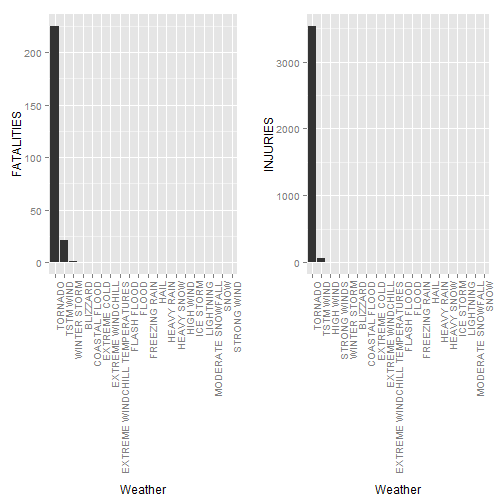

Reproduducible Pitch Presentation Project Assignment
========================================================
date: 21 Jun 2015

Storm Events Analysis with variable Wheather Events slider Shiny APP
========================================================

The code for this <b>shiny application</b> is based on the PeerAssment for Courseras Reproducible Research.
One of the questions needed to be answered is The following question:Across the United States, which types of wheather events are most harmful with respect to population health?<br>
When analysing data it could be useful to see what impact it has to include a different number of wheather events in the analysis<br>
For this purpose a <b>shiny application</b> is written to make the number of wheater events a variable.Please note that the code included in this presentation is redundant. Not every shiny code detail is explained.
Please see github repository for shiny app ui.R and server.R code

Slide With Stormdata Code 1
=====================================================================


```r
library(R.utils); library(ggplot2);library(plyr);library(gridExtra); require(gridExtra)
#Use reduced data for testing purposes instead original (143 MB) 
stormData <- read.csv("repdata-data-StormData-reduced.csv", sep = ",")
#data filter to reduce data 
fieldFilter <- function(field, data, topNbOfWheatherTypes) {
  index <- which(colnames(data) == field)
  aggregate <- aggregate(data[, index], by = list(data$EVTYPE), FUN = "sum")
  names(aggregate) <- c("EVTYPE", field)
  aggregate <- arrange(aggregate, aggregate[, 2], decreasing = T)
  aggregate <- head(aggregate, n = topNbOfWheatherTypes)
  return(within(aggregate, EVTYPE <- factor(x = EVTYPE, levels = aggregate$EVTYPE)))
 } 
```

Slide With Stormdata Code 2
=====================================================================

```r
#number of events, this is made variable in the shiny application by using
# slider input from ui.R and using
# events <- input$events 
#For reproducible presentation purposes the number is fixed to 25 so that a Slide can be plotted.
#For this prentation assume event=20 
events<-20  
#create fatalities and injuries data for top 20 storm data Events and print the diagram
fatalities <- fieldFilter("FATALITIES", stormData, events)
injuries <- fieldFilter("INJURIES", stormData, events)  
```

Slide With Plot
========================================================

 
